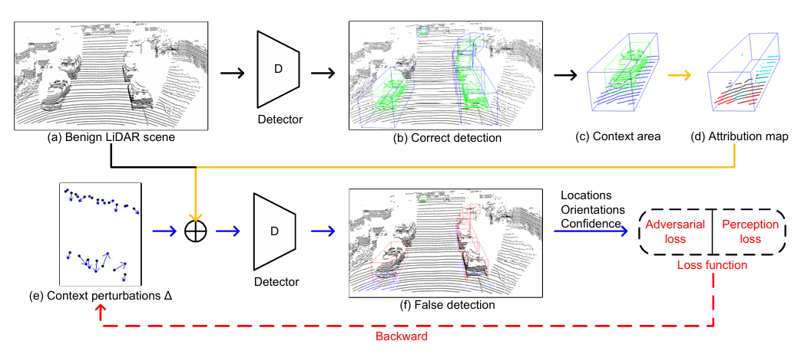

 # Contextual attribution maps guided transferable adversarial attack for 3D object detection





Here we only provide the functions of contextual assessment and adversarial attack in 3D object detection. The whole project is based on 3D_Corruptions_AD and built upon MMDetection3D and OpenPCDet with necessary modifications of its source code.

## Prerequisites
* Python (3.9)
* Pytorch (1.9.0)
* numpy
* MMDetection3D
* OpenPCDet

## Contextual assessment

### Implemented in MMDetection3D pipeline

In the MMDetection3D pipeline, we modified the `mmdetection3d/mmdet3d/datasets/pipelines/test_time_aug.py`, the modification examples are:
```python
@TRANSFORMS.register_module()
class CorruptionMethods(object):
    def __init__(self, corruption_severity_dict=None):


        if corruption_severity_dict is None:
            corruption_severity_dict = {
                'NoCor': 2,
            }
        self.corruption_severity_dict = corruption_severity_dict

    def __call__(self, results):
        """Call function to augment common corruptions.
        """

        if 'NoCor' in self.corruption_severity_dict:
            return results

        if 'NoCar_bbox' in self.corruption_severity_dict:
            pl = results[0]['points'].tensor
            data = []

            # data.append(results['gt_bboxes_3d'])
            if 'gt_bboxes_3d' in results[0]:
                data.append(results[0]['gt_bboxes_3d'])
            else:
                # waymo
                data.append(results[0]['eval_ann_info']['gt_bboxes_3d'])

            # gt_bbox3d = results[0]['eval_ann_info']['gt_bboxes_3d'].tensor
            # print(pl.shape, gt_bbox3d.shape)
            severity = self.corruption_severity_dict['NoCar_bbox']
            points_aug = Nocar_bbox(pl.numpy(), severity, data)
            # name = results[0]['lidar_path'].replace('velodyne_reduced', 'nocar' + str(severity))
            # points_aug.tofile(name)
            pl = torch.from_numpy(points_aug)
            results[0]['points'].tensor = pl

        return results

```

Then add 'CorruptionMethods' to the test pipeline, modify the corresponding config files in `mmdetection3d/configs/`.
Such as the config for PointPillars `configs/pointpillars/hv_pointpillars_secfpn_6x8_160e_kitti-3d-3class.py`, the modification examples are:

```python
test_pipeline = [
    dict(
        type='LoadPointsFromFile',
        coord_type='LIDAR',
        load_dim=4,
        use_dim=4,
        backend_args=backend_args),
    dict(
        type='MultiScaleFlipAug3D',
        img_scale=(1333, 800),
        pts_scale_ratio=1,
        flip=False,
        transforms=[
            dict(
                type='GlobalRotScaleTrans',
                rot_range=[0, 0],
                scale_ratio_range=[1., 1.],
                translation_std=[0, 0, 0]),
            dict(type='RandomFlip3D'),
            dict(
                type='PointsRangeFilter', point_cloud_range=point_cloud_range)
        ]),

    dict(
            type='CorruptionMethods',
            corruption_severity_dict=
                {
                    'NoCar_bbox': 4,
                    # 'NoCor': 0
                },
        ),

    dict(type='Pack3DDetInputs', keys=['points'])
]


```


## CAMGA

### Implemented in OPENPCDet pipeline

use `CAMGA_attack.py` replace `tools/test.py`, and move `eval_utils/camga_attack_utils.py` to `tools/utils/`


